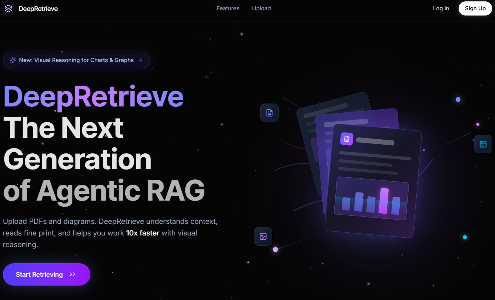

# 🔍 DeepRetrieve

### Agentic Multimodal RAG System

**DeepRetrieve** is an advanced, fully agentic Retrieval-Augmented Generation (RAG) system built to chat with dense PDFs. It processes **text, images, and tables**, utilizing entirely **local, GPU-accelerated embedding models (`BAAI/bge-base`)**, local vision models (`EasyOCR` and `BLIP`), and utilizes the modern `google-genai` SDK to power an autonomous **Gemini 2.5 Flash** agent. The agent dynamically routes queries through **Qdrant vector search** and **Tavily web search** to synthesize streaming, highly detailed, and source-attributed answers.

<div align="center">



</div>

---

## 🏗️ Architecture

### How it works

| Phase | What happens |
|---|---|
| **Extraction** | PyMuPDF sequentially reads digital text. For dense visual charts and scanned pages, **EasyOCR (CUDA)** extracts raw text. For generic images, **Salesforce BLIP** generates visual captions entirely locally. |
| **Embedding** | All modalities are embedded locally using **`BAAI/bge-base-en-v1.5`** generating robust 768-dimensional vectors. |
| **Indexing** | Embedded chunks are pushed instantly to **Qdrant Cloud** collections. |
| **Orchestration** | User poses a question. The **Gemini 2.5 Agent** natively utilizes **Automatic Function Calling** to intelligently invoke `rag_retrieve` (for document context) or `web_search` (Tavily, for exterior knowledge). |
| **Synthesis** | The synthesized answer is streamed back via Server-Sent Events (SSE) with smooth, typewriter-like rendering. |

---

## ✨ Features

### 🎯 Core Capabilities
- **📄 Complete Multimodal Parsing** — Extracts exact text, captions images via `BLIP`, and intelligently parses technical tables and scanned graphs via `EasyOCR`.
- **🚀 Local ML Acceleration** — Embeddings and OCR pipelines run locally on your hardware (CUDA/CPU), drastically reducing strict reliance on costly third-party ML APIs.
- **🤖 Agentic Routing** — Gemini 2.5 Flash natively orchestrates its own pipeline, seamlessly deciding when to search your documents vs when to fall back to the live internet.
- **🌐 Web Search Fallback** — Tavily API integration fills the gaps dynamically when PDF documents lack the modern context required to answer a query.
- **⚡ Qdrant Vector Search** — Scalable, ultra-fast cosine similarity matching.
- **🧠 Continuous Memory** — Multi-turn chat context ensures follow-up questions are resolved flawlessly.

### 🎨 Premium UI / UX
- **Typewriter Streaming** — Micro-chunked SSE stream ensures incredibly fluid, butter-smooth visual text rendering.
- **Exquisite Markdown** — Fully customized Tailwind Typography (`prose`) for high-fidelity rendering, beautiful code blocks, and automatically structured tabular data.
- **Interactive Image Viewer** — Hovering over visual sources reveals an active `<Expand />` action, opening actual extracted diagrams directly in a sleek, frosted-glass Modal Overlay!
- **Source Attribution** — Every single chat interaction carries verified Source Cards dictating Confidence, Page Number, and Document identity.

---

## 🚀 Quick Start

### Prerequisites

| Requirement | Notes |
|---|---|
| **Python** | 3.10+ |
| **Node.js** | 18+ |
| **CUDA Drivers** | (Optional but Highly Recommended) For massive speedups on EasyOCR and BLIP parsing. |
| **Qdrant Cloud** | [Free tier](https://cloud.qdrant.io/) cluster for vector storage. |
| **Google AI Studio** | [Free API key](https://ai.google.dev/) for Gemini 2.5. |
| **Tavily** | [Free tier](https://tavily.com/) for Agentic live-web search. |

### Installation

#### 1. Clone the repository
```bash
git clone https://github.com/Hariprasaadh/DeepRetrieve.git
cd DeepRetrieve
```

#### 2. Backend setup
```bash
cd backend

# Create a virtual environment and install ML dependencies
python -m venv ai_env
ai_env\Scripts\activate  # Windows
# source ai_env/bin/activate # Mac/Linux

pip install -r requirements.txt
```

#### 3. Environment configuration

Create a `.env` file inside the `backend/` directory:

```env
# Qdrant Cloud DB
QDRANT_URL=https://your-cluster-url.qdrant.io
QDRANT_API_KEY=your_qdrant_api_key

# Google Gemini Intelligence
GOOGLE_API_KEY=your_google_api_key

# Tavily Web Search
TAVILY_API_KEY=your_tavily_api_key
```

#### 4. Frontend setup
```bash
cd ../frontend
npm install
npm run dev
```

#### 5. Start the backend
```bash
# In a separate terminal
cd backend
python main.py
```

The application will be running at:
- **Frontend Panel**: http://localhost:5173
- **Backend API**: http://localhost:8000
- **API Swagger Docs**: http://localhost:8000/docs

---

## 🔧 API Reference

All endpoints natively expose `/api/v1`.

### `POST /api/v1/upload`
Upload and locally process a PDF document.

**Request:** `multipart/form-data` with a `file` field.
**Response:** Success stats regarding how many text blocks, images, and tables were encoded to vector space.

### `POST /api/v1/query-stream`
Ask the Agent a question dynamically, returning a Server-Sent Events (SSE) stream containing metadata overrides, tool executions, and typewriter chat chunks.

### `GET /api/v1/upload-progress/{filename}`
Stream real-time background parsing percentage dynamically to the frontend during hefty PDF processing.

### `DELETE /api/v1/reset`
Wipe the active Qdrant vector collection and rigorously clear local cached image hierarchies to reset the brain.

---

## 🛠️ Tech Stack Evolution

| Layer | Technology |
|---|---|
| **Frontend** | React 18, Vite, Tailwind CSS, Framer Motion, `react-markdown` |
| **Backend Core** | FastAPI, Uvicorn, Python 3.12 |
| **Embeddings** | `BAAI/bge-base-en-v1.5` (768-dim, running locally via sentence-transformers) |
| **Vector DB** | Qdrant Cloud |
| **LLM Orchestration** | Google Gemini 2.5 Flash via `google-genai` Automated Function Calling |
| **Web Search** | Tavily Search SDK |
| **Document Vision** | PyMuPDF (Text), EasyOCR (Scanned/Dense Tables), Salesforce BLIP (Vision Captioning) |

---

<div align="center">

### ⭐ Star this repo if you find it helpful!

*Empowering intelligent, highly-detailed document understanding through multimodal agentic RAG*

</div>
