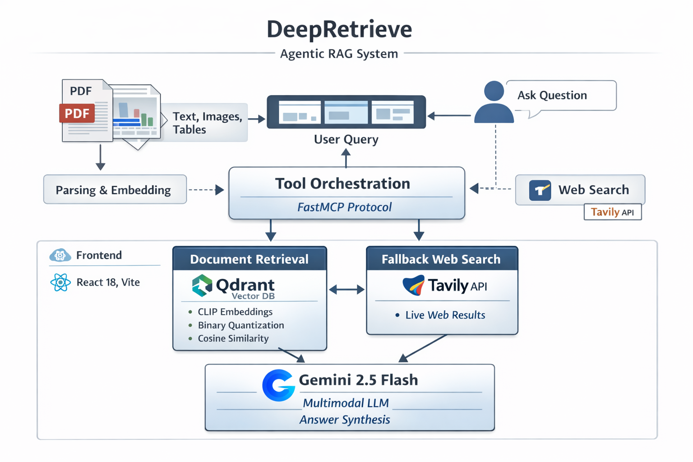

# 🔍 DeepRetrieve

### Agentic Multimodal RAG System

**DeepRetrieve** is an agentic Retrieval-Augmented Generation system that lets you chat with your PDF documents. It extracts and understands **text, images, and tables** from PDFs, uses **CLIP embeddings** for multimodal semantic search, and uses a **FastMCP-powered tool orchestration layer** to autonomously decide whether to search your documents, the live web, or both — routing through **Qdrant vector search** and **Tavily web search** before synthesizing a precise, source-attributed answer with **Google Gemini 2.5 Flash**.

<div align="center">


</div>

---

## 🏗️ Architecture

<div align="center">
  
</div>

### How it works

| Phase | What happens |
|---|---|
| **Upload** | PDF → PyMuPDF extracts text chunks & images, Camelot extracts tables → Gemini Vision captions every image → CLIP embeds all modalities → stored in Qdrant Cloud |
| **Query** | User question → Gemini agent autonomously calls `rag_retrieve` (vector search) and/or `web_search` (Tavily) via function calling → synthesizes final answer with source attribution |
| **MCP** | The same RAG tools are exposed as a **Model Context Protocol server** via FastMCP, allowing any MCP-compatible AI client to connect and use the knowledge base directly |

---

## ✨ Features

### 🎯 Core Capabilities
- **📄 Multimodal PDF Processing** — extracts text, images, and tables in one pipeline
- **🤖 Agentic RAG** — Gemini 2.5 Flash autonomously orchestrates tool calls to answer questions
- **🔍 Unified Semantic Search** — CLIP embeddings enable cross-modal text ↔ image retrieval
- **📊 Table Understanding** — tables extracted via Camelot, stored and retrieved as structured data
- **🖼️ Visual Analysis** — charts and diagrams are captioned by Gemini Vision before indexing
- **🌐 Web Search Fallback** — Tavily API fills gaps when documents don't contain the answer
- **⚡ Efficient Retrieval** — Qdrant Cloud with Binary Quantization (~32× storage reduction)
- **🧠 Conversation Memory** — multi-turn chat with last 3 turns passed as context
- **📝 Source Attribution** — every answer cites document name, page number, and content type
- **🔌 MCP Server** — expose your knowledge base to any MCP-compatible AI client

### 🎨 User Interface
- **Landing Page** — hero section, feature showcase, comparison table, live upload widget
- **Interactive Chat** — real-time Q&A with animated loading states and source cards
- **Split View** — simultaneous chat and PDF preview panels
- **Responsive Design** — works on desktop and mobile

---

## 🚀 Quick Start

### Prerequisites

| Requirement | Version | Notes |
|---|---|---|
| Python | 3.10+ | |
| Node.js | 18+ | |
| Qdrant Cloud | — | [Free tier](https://cloud.qdrant.io/) |
| Google AI Studio | — | [Free API key](https://ai.google.dev/) |
| Tavily | — | [Free tier](https://tavily.com/) — for web search |

### Installation

#### 1. Clone the repository
```bash
git clone https://github.com/Hariprasaadh/DeepRetrieve.git
cd DeepRetrieve
```

#### 2. Backend setup
```bash
cd backend

# Install dependencies
uv pip install -r requirements.txt
# or: pip install -r requirements.txt
```

#### 3. Environment configuration

Create a `.env` file inside the `backend/` directory:

```env
# Qdrant Cloud
QDRANT_URL=https://your-cluster-url.qdrant.io
QDRANT_API_KEY=your_qdrant_api_key

# Google Gemini
GOOGLE_API_KEY=your_google_api_key

# Tavily Web Search
TAVILY_API_KEY=your_tavily_api_key
```

> **Get your keys:**
> - **Qdrant** → [cloud.qdrant.io](https://cloud.qdrant.io/) — create a free cluster and copy the URL + API key
> - **Google Gemini** → [ai.google.dev](https://ai.google.dev/) — generate a Gemini API key
> - **Tavily** → [tavily.com](https://tavily.com/) — sign up for a free search API key

#### 4. Frontend setup
```bash
cd ../frontend
npm install
npm run dev
```

#### 5. Start the backend
```bash
# In a separate terminal
cd backend
python api/run.py
```

The app will be running at:
- **Frontend**: http://localhost:5173
- **Backend API**: http://localhost:8000
- **API Docs**: http://localhost:8000/docs

---

## 📖 Usage

### Web Interface

1. Go to http://localhost:5173
2. Upload a PDF using the upload widget on the landing page
3. You'll be redirected to the chat interface automatically
4. Ask any question — the agent searches your document and/or the web as needed
5. View answers with source cards showing document name, page, and content type

### Query via API

```python
import requests

# Upload a PDF
with open("my_document.pdf", "rb") as f:
    r = requests.post("http://localhost:8000/api/v1/upload", files={"file": f})
print(r.json())

# Ask a question
r = requests.post("http://localhost:8000/api/v1/query", json={
    "query": "What are the key findings?",
    "top_k": 5,
    "conversation_history": []
})
print(r.json()["answer"])
```

---

## 🔌 MCP Server

DeepRetrieve ships with a **Model Context Protocol (MCP) server** built with [FastMCP](https://github.com/jlowin/fastmcp). This lets any MCP-compatible AI client (Claude Desktop, Cursor, etc.) connect directly to your document knowledge base.

### Available MCP Tools

| Tool | Description |
|---|---|
| `rag_retrieve` | Semantic vector search over all indexed documents (text, images, tables) |
| `fallback_web_search` | Live web search via Tavily when documents don't contain the answer |
| `hybrid_search` | RAG retrieval with automatic web fallback if relevance score is low |
| `generate_answer` | LLM answer synthesis from a given context string |
| `get_knowledge_base_info` | Returns collection stats (document count, vector count, etc.) |


---

## 🔧 API Reference

All endpoints are prefixed with `/api/v1`.

### `GET /api/v1/ping`
Health check.
```json
{ "status": "ok", "message": "DeepRetrieve API is running!" }
```

### `POST /api/v1/upload`
Upload and index a PDF document.

**Request:** `multipart/form-data` with a `file` field (PDF only)

**Response:**
```json
{
  "success": true,
  "message": "Successfully processed document.pdf",
  "filename": "document.pdf",
  "texts_added": 45,
  "images_added": 12,
  "tables_added": 3
}
```

### `POST /api/v1/query`
Ask a question. The agent autonomously decides which tools to use.

**Request:**
```json
{
  "query": "What are the main conclusions?",
  "top_k": 5,
  "conversation_history": [
    { "role": "user", "content": "What is this document about?" },
    { "role": "assistant", "content": "It covers..." }
  ]
}
```

**Response:**
```json
{
  "success": true,
  "query": "What are the main conclusions?",
  "answer": "The document concludes that...",
  "sources": [
    {
      "type": "text",
      "content": "Content preview...",
      "source": "document.pdf",
      "page": 4,
      "score": 0.91
    }
  ],
  "used_web_search": false
}
```

### `GET /api/v1/tools`
List all registered MCP tools.

### `DELETE /api/v1/reset`
Clear the Qdrant collection and all extracted images/tables.

---

## ⚙️ Configuration

All configuration lives in `backend/mcp_server/config.py`:

```python
# Model
CLIP_MODEL_NAME = "openai/clip-vit-base-patch32"  # Local CLIP (CPU/GPU auto-detected)
EMBEDDING_DIM   = 512
GEMINI_MODEL    = "gemini-2.5-flash"

# Retrieval
COLLECTION_NAME      = "multimodal_rag"
TOP_K                = 5
RELEVANCE_THRESHOLD  = 0.5   # Minimum score before triggering web fallback

# Rate limiting (to stay within free-tier quotas)
RATE_LIMIT_WINDOW       = 60   # seconds
MAX_CALLS_PER_WINDOW    = 10
MIN_DELAY_BETWEEN_CALLS = 2    # seconds
MAX_RETRIES             = 3
```

---

## 🛠️ Tech Stack

| Layer | Technology |
|---|---|
| Frontend | React 18, Vite, React Router, Framer Motion |
| Backend | FastAPI, Uvicorn, Python 3.10+ |
| Embeddings | CLIP `openai/clip-vit-base-patch32` (local) |
| Vector DB | Qdrant Cloud (Binary Quantization, Cosine Similarity) |
| LLM | Google Gemini 2.5 Flash (agentic function calling + vision) |
| Web Search | Tavily Search API |
| PDF Parsing | PyMuPDF (text + images), Camelot (tables) |
| MCP Protocol | FastMCP |
| Deployment | Vercel (frontend) |

---

<div align="center">

### ⭐ Star this repo if you find it helpful!

*Empowering intelligent document understanding through multimodal RAG*

</div>
