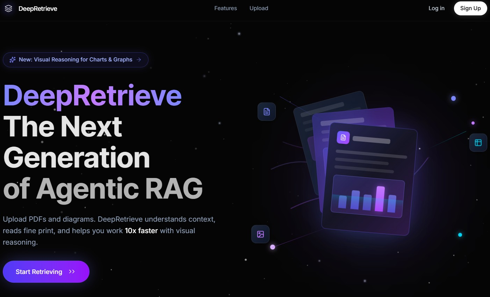
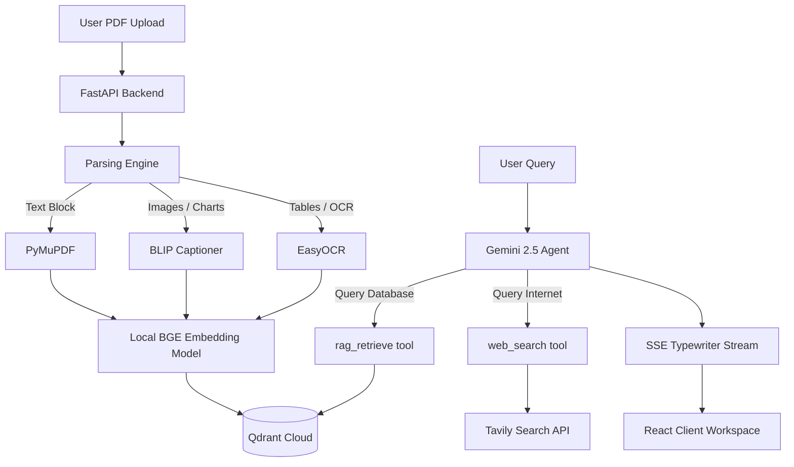

# 🔍 DeepRetrieve

### Agentic Multimodal RAG System

**DeepRetrieve** is an advanced, fully agentic Retrieval-Augmented Generation (RAG) system built to chat with dense, complex PDFs. It extracts and indexes **text, images, and tables** utilizing entirely **local, GPU-accelerated embedding models (`BAAI/bge-base`)**, local vision helper models (`EasyOCR` and `BLIP`), and utilizes the modern `google-genai` SDK to power an autonomous **Gemini 2.5 Flash** agent. The agent dynamically routes queries through **Qdrant vector search** and **Tavily web search** to synthesize streaming, highly detailed, and source-attributed answers.

<div align="center">
  
</div>

---

## 📌 Table of Contents

- [System Architecture](#️-system-architecture)
- [Core Features](#-core-features)
- [ Quick Start](#-quick-start)
- [ API Endpoints Overview](#-api-endpoints-overview)
- [ Model Context Protocol (MCP) Server](#-model-context-protocol-mcp-server)
- [ Developer Documentation Links](#-developer-documentation-links)
- [ Technical Stack Evolution](#️-technical-stack-evolution)

---

##  System Architecture

DeepRetrieve coordinates local extraction engines with cloud vector indexing and intelligence models to ingest data and process queries.


```mermaid
graph TD
    A[User PDF Upload] --> B[FastAPI Backend]
    B --> C[Parsing Engine]
    C -->|Text Block| D[PyMuPDF]
    C -->|Images / Charts| E[BLIP Captioner]
    C -->|Tables / OCR| F[EasyOCR]
    
    D & E & F --> G[Local BGE Embedding Model]
    G --> H[(Qdrant Cloud)]
    
    I[User Query] --> J[Gemini 2.5 Agent]
    J -->|Query Database| K[rag_retrieve tool]
    K --> H
    J -->|Query Internet| L[web_search tool]
    L --> M[Tavily Search API]
    
    J --> N[SSE Typewriter Stream]
    N --> O[React Client Workspace]
```

*For an in-depth analysis of the system architecture, check the [Architecture Documentation](file:///c:/Users/Dell/Documents/GitHub/DeepRetrieve/docs/architecture.md).*

---

## ✨ Core Features

### Complete Multimodal Parsing
- **Digital & Scanned Extraction**: Extracts text seamlessly using PyMuPDF. For dense layouts, graphs, and scanned sheets, it triggers **EasyOCR** (CUDA accelerated) for visual reconstruction.
- **Visual Captioning**: Converts figures and drawings into search-optimized text indices using a local **Salesforce BLIP** captioning pipeline.

### Autonomous Agent Orchestration
- **Orchestrated Routing** — The MCP Server coordinates the tool routing loop, orchestrating queries to local document archives (`rag_retrieve`) or fallback web search engines (`web_search`) depending on similarity threshold checks.
- **Keyword-Overlap Check & Fallback**: Validates similarity match rates. If similarity confidence drops below the threshold, Tavily Web Search activates to guarantee correct answers.

### Sleek UI/UX
- **Smooth Streaming**: Server-Sent Events (SSE) stream text back with a fluid, typewriter-like token delivery.
- **Source Citation Cards**: Dynamic reference overlays show document location, page coordinates, and confidence levels. Hovering visual sources reveals an expand overlay to view images.

---

## 🚀 Quick Start

### Prerequisites
- **Python**: `3.10` to `3.12`
- **Node.js**: `18.0.0+`
- **NVIDIA GPU (Recommended)**: For CUDA acceleration.

### Step-by-Step Installation

#### 1. Clone the repository
```bash
git clone https://github.com/Hariprasaadh/DeepRetrieve.git
cd DeepRetrieve
```

#### 2. Backend Environment Setup
```bash
cd backend
pip install -r requirements.txt
```

#### 3. Environment Variables
Create a `.env` file in the `backend/` directory:
```env
QDRANT_URL=https://your-cluster.qdrant.io
QDRANT_API_KEY=your_qdrant_api_key
GOOGLE_API_KEY=your_google_gemini_api_key
TAVILY_API_KEY=your_tavily_web_search_key
```

#### 4. Frontend Workspace Setup
```bash
cd ../frontend
npm install
npm run dev
```

#### 5. Launch the Application
- Frontend Panel: http://localhost:5173
- Backend REST API: http://localhost:8000
- Swagger Documentation: http://localhost:8000/docs

*For comprehensive setups, troubleshooting, or PyTorch CUDA installation details, view the [Setup and Troubleshooting Guide](file:///c:/Users/Dell/Documents/GitHub/DeepRetrieve/docs/setup_guide.md).*

---

## API Endpoints Overview

| Method | Endpoint | Description |
|---|---|---|
| `GET` | `/api/v1/ping` | Connection status verification |
| `POST` | `/api/v1/upload` | Upload and extract PDF data |
| `GET` | `/api/v1/upload-progress/{filename}` | Real-time extraction progress event stream |
| `POST` | `/api/v1/query` | Synchronous RAG query endpoint |
| `POST` | `/api/v1/query-stream` | SSE token stream yielding typewriter replies |
| `DELETE` | `/api/v1/reset` | Clear collection indices and file caches |

*Refer to the [API Endpoint Specification](file:///c:/Users/Dell/Documents/GitHub/DeepRetrieve/docs/api_spec.md) for full parameters and return JSON schemas.*

---

## Model Context Protocol (MCP) Server

DeepRetrieve exposes an MCP server wrapper, enabling LLM clients to communicate directly with document collections via tool calling:
- **Exposed Tools**: `rag_retrieve`, `web_search`, `hybrid_retrieve`, `generate_answer`, `get_knowledge_base_info`.
- **Communication Channel**: Stdio transport layer.

*To register DeepRetrieve with Cursor IDE or Claude Desktop, see the [Model Context Protocol Integration Guide](file:///c:/Users/Dell/Documents/GitHub/DeepRetrieve/docs/mcp_spec.md).*

---

## Developer Documentation Links

Detailed architectural descriptions and guides are located in the `docs/` folder:
1. **[System Architecture Reference](file:///c:/Users/Dell/Documents/GitHub/DeepRetrieve/docs/architecture.md)** — Data pipeline flow details and model specs.
2. **[Environment Setup & Troubleshooting Guide](file:///c:/Users/Dell/Documents/GitHub/DeepRetrieve/docs/setup_guide.md)** — Virtualenv packages, PyTorch CUDA wheel setups, and common resolutions.
3. **[REST API Specifications](file:///c:/Users/Dell/Documents/GitHub/DeepRetrieve/docs/api_spec.md)** — Payload details, stream flows, and SSE schemas.
4. **[Model Context Protocol Guide](file:///c:/Users/Dell/Documents/GitHub/DeepRetrieve/docs/mcp_spec.md)** — MCP integration parameters and developer configuration.

---

## Technical Stack Evolution

| Service Layer | Technology Implemented |
|---|---|
| **Frontend UI** | React 18, Vite, Tailwind CSS, Framer Motion, `react-markdown` |
| **Backend Core** | FastAPI, Uvicorn, Python 3.12 |
| **Embeddings Model** | `BAAI/bge-base-en-v1.5` (768-dim, running locally via sentence-transformers) |
| **Vector DB Store** | Qdrant Cloud |
| **Agent Intelligence** | Google Gemini 2.5 Flash via `google-genai` SDK Function Calling |
| **Fallback Web Search** | Tavily Search SDK |
| **Multimodal Vision** | PyMuPDF (Text), EasyOCR (Scanned/Tables), Salesforce BLIP (Visual Captioning) |

---

<div align="center">

### ⭐ Star this repo if you find it helpful!

*Empowering intelligent, highly-detailed document understanding through multimodal agentic RAG*

</div>
