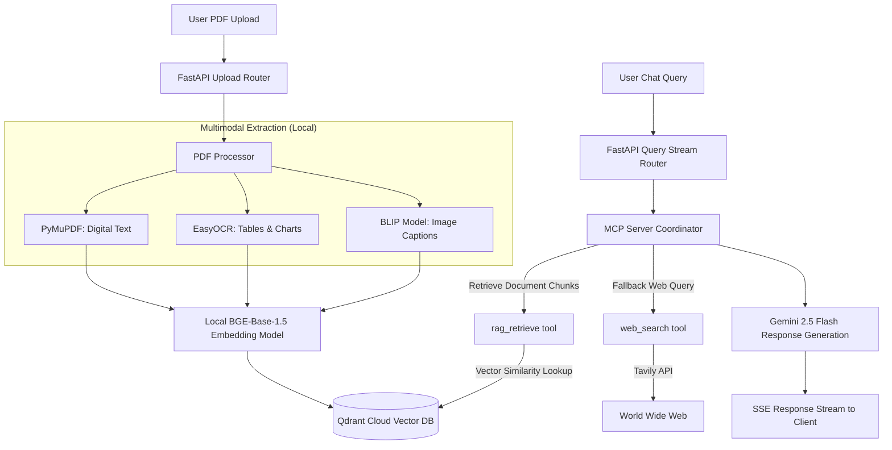
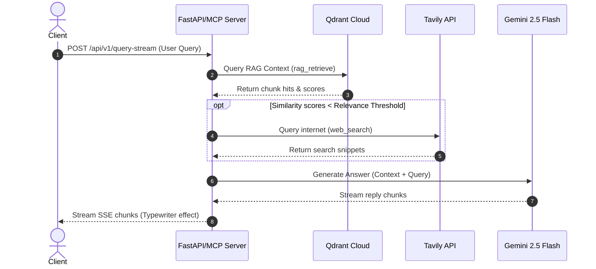

# DeepRetrieve System Architecture

DeepRetrieve is designed as a multimodal Retrieval-Augmented Generation (RAG) platform. It extracts and indexes textual, structured tabular, and visual information from PDF documents entirely on local hardware, utilizing an MCP Server to orchestrate query retrieval and model interactions.

---

## System Overview

The system consists of two primary operational pipelines:
1. **Multimodal Ingestion Pipeline**: Extracts data from various document modalities, computes vector representations, and registers them to a vector index.
2. **Orchestrated Query & Retrieval Pipeline**: Evaluates user queries, uses the MCP Server to dynamically retrieve document embeddings or query the live web, and streams synthesized answers.

---

## 1. Ingestion Pipeline Details

The ingestion process is triggered via the `/api/v1/upload` endpoint and proceeds as follows:

### Step 1.1: Document Parsing & Extraction
- **Digital Text**: PyMuPDF reads standard layout texts page-by-page.
- **Scanned Documents & Dense Tables**: When tabular borders or dense page segments are identified, **EasyOCR** (configured to run on GPU via CUDA) runs OCR to extract cell contents, preserving structures.
- **Visual Images**: Embedded diagrams, charts, and drawings are extracted to a local directory (`backend/extracted_content/images`). DeepRetrieve runs a local **Salesforce BLIP (Bootstrapping Language Image Pre-training)** image captioning model. The generated captions are used to represent the image semantically.

### Step 1.2: Local Dense Vector Generation
- Extracted elements (texts, captions, tables) are divided into chunks.
- Chunks are run through a local instance of the **`BAAI/bge-base-en-v1.5`** SentenceTransformer model (768 dimensions), utilizing PyTorch CUDA acceleration where available.
- **Query Prefixing**: The query embeddings are computed with a retrieval instruction prefix (`Represent this sentence for searching relevant passages: `) to optimize cosine similarity match results.

### Step 1.3: Vector Storage with Binary Quantization (BQ)
- Generated dense vectors are written to **Qdrant Cloud**.
- **Performance Optimization**: The target Qdrant collection is configured with **Binary Quantization**. BQ converts float32 vector components into binary representation bits. This reduces index memory usage by up to 95% and provides up to a 10x retrieval speedup, with negligible loss in similarity precision.

---

## 2. Orchestrated Retrieval & Query Execution

Queries are posted to `/api/v1/query-stream` and handled dynamically:

### Step 2.1: Tool Orchestration & Routing
- DeepRetrieve implements a modular **MCP Server** layout defining client-accessible tools using the `FastMCP` framework.
- The MCP Server orchestrates execution pathways between two core tools:
  1. `rag_retrieve`: Queries the Qdrant vector database.
  2. `web_search`: Queries the external Tavily Search API.

### Step 2.2: Hybrid Retrieval and Fallbacks
- During query processing, the routing logic calls `rag_retrieve` to inspect the indexed PDF content.
- A **Keyword Overlap Validation** check evaluates document relevance. If the similarity confidence scores fall below the configured `RELEVANCE_THRESHOLD` (default: `0.5`), the routing layer automatically triggers `web_search` to fetch additional internet context.
- Once the optimal context blocks are accumulated, they are formatted and forwarded alongside the query to the Gemini 2.5 Flash model for response generation.

### Step 2.3: Typewriter SSE Streaming
- The generated response is piped into a background queue.
- A FastAPI SSE generator yields tokens chunk-by-chunk to the React client, achieving a fluid, typing dashboard experience.
